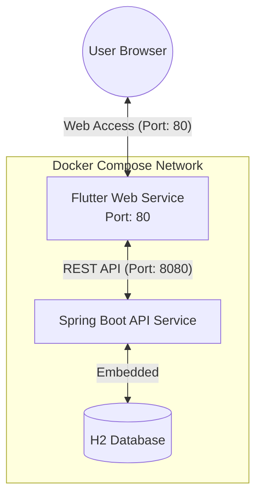
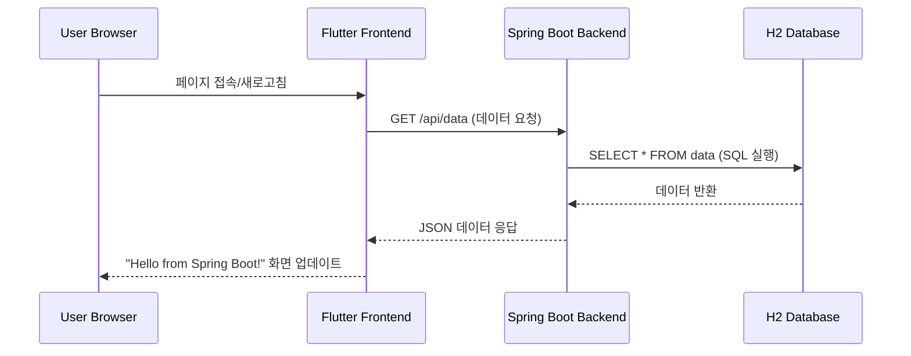
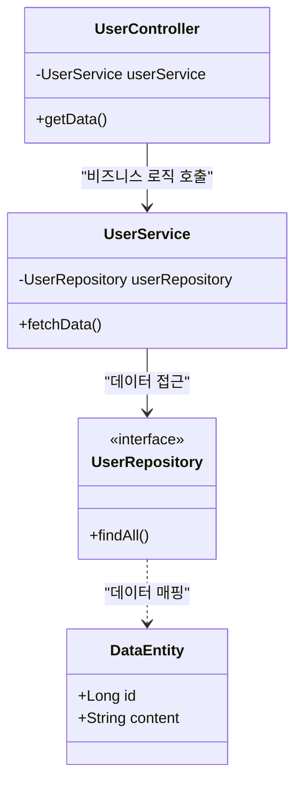
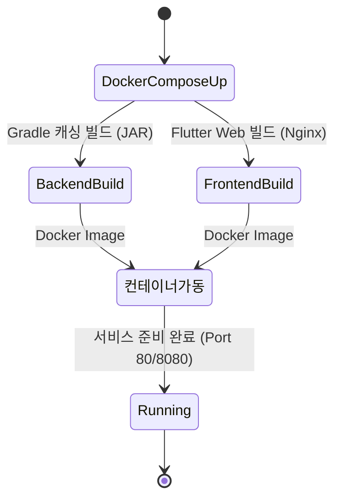

# 🚀 Flutter + Spring Boot Docker Full-Stack Sample

이 프로젝트는 **Flutter Web** 프런트엔드와 **Spring Boot 3** 백엔드를 도커(Docker) 컨테이너로 통합 관리하는 샘플 프로젝트입니다. 환경 변수(`.env`)를 사용하여 하드코딩 없이 서버 IP를 관리하며, 멀티 스테이지 빌드와 레이어 캐싱으로 배포 효율을 극대화했습니다.

---

## 🛠 Tech Stack
- **Frontend**: Flutter 3.x (Web)
- **Backend**: Spring Boot 3.x (Java 17 / Amazon Corretto)
- **Infrastructure**: Docker, Docker Compose, Nginx

---

## 📂 Project Structure
```text
.
├── .env                 # [중요] 서버 IP 주소 설정 (Git 제외)
├── docker-compose.yml   # 전체 서비스 오케스트레이션 및 환경 변수 전달
├── backend/             # Spring Boot 프로젝트
│   └── Dockerfile       # Gradle 의존성 캐싱 적용 빌드
└── frontend/            # Flutter Web 프로젝트
    └── Dockerfile       # 빌드 시점에 BASE_URL 주입 및 Nginx 배포
```

---

## 🏗️ 시스템 아키텍처 (Architecture)



## 🔄 데이터 흐름 (Data Interaction Flow)



## 📂 백엔드 구조 (Backend Class Structure)



## 🛠️ 빌드 및 배포 프로세스 (Build & Deploy)



---

## 🚀 Quick Start (Local Development)

로컬에 개발 환경이 없어도 Docker만 있으면 바로 실행 가능합니다.

1. **Repository Clone**
   ```bash
   git clone [https://github.com/bymond17/docker-flutter-springboot-sample.git](https://github.com/bymond17/docker-flutter-springboot-sample.git)
   cd docker-flutter-springboot-sample
   ```

2. **환경 변수 파일 생성**
   루트 폴더에 `.env` 파일을 만들고 주소를 입력합니다. (localhost 사용 시)
   ```text
   BASE_URL=http://localhost:8080
   ```

3. **Run Containers**
   ```bash
   docker-compose up --build
   ```

4. **접속 주소**
   - **Frontend**: [http://localhost](http://localhost)
   - **Backend API**: [http://localhost:8080/api/data](http://localhost:8080/api/data)

---

## ⚙️ Key Optimization

### 1. 환경 변수 주입 (Environment Injections)
- **Flow**: `.env` ➔ `docker-compose.yml` ➔ `Dockerfile (ARG)` ➔ `Flutter (--dart-define)`
- 프런트엔드에서 `String.fromEnvironment('BASE_URL')`를 통해 빌드 시점에 서버 주소를 동적으로 주입받습니다.

### 2. 빌드 최적화 (Multi-stage Build)
- **Backend**: Gradle 의존성 레이어를 소스 코드보다 먼저 복사하여 **캐싱 효율**을 높였습니다.
- **Frontend**: 빌드 환경과 실행 환경(Nginx)을 분리하여 **최종 이미지 크기를 최소화**했습니다.

---

## 📄 License
This project is licensed under the MIT License.