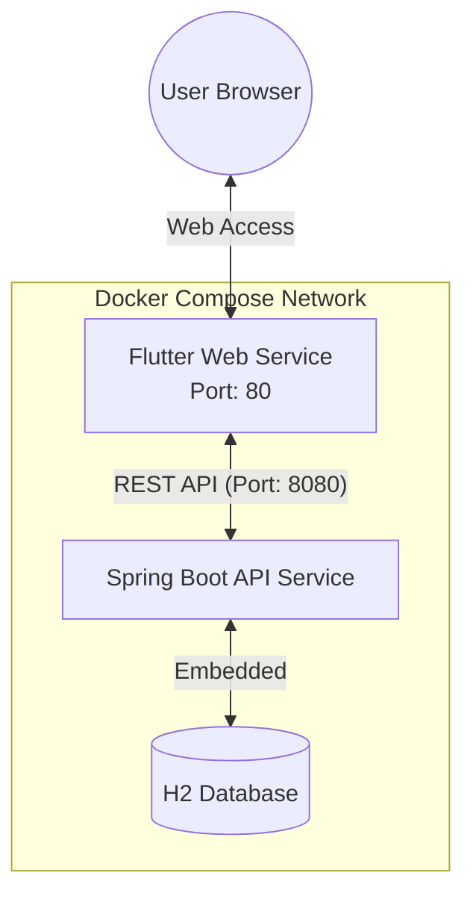
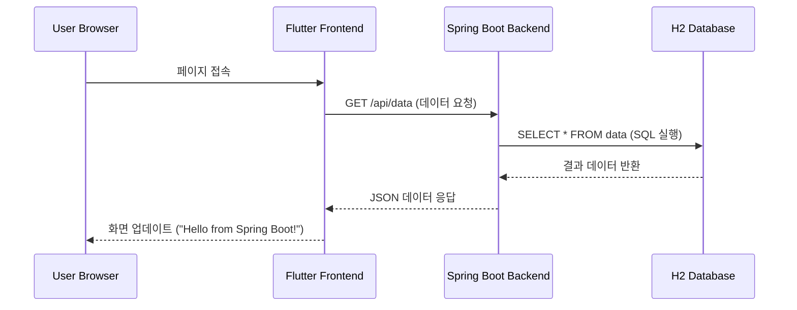
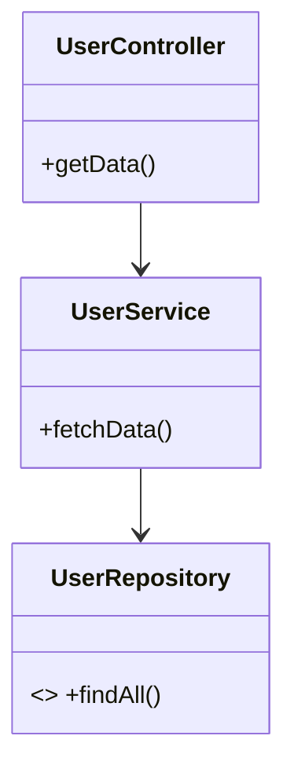
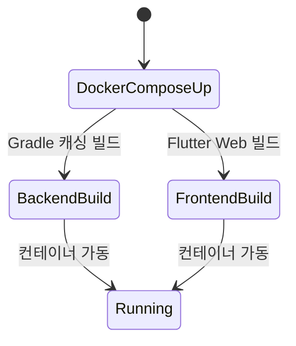

# 🚀 Flutter + Spring Boot Docker Full-Stack Sample

이 프로젝트는 **Flutter Web**과 **Spring Boot 3**를 도커로 통합 관리하는 샘플입니다. 환경 변수(`.env`) 기반의 설정 관리와 멀티 스테이지 빌드를 통한 최적화된 배포 구조를 제공합니다.

---

## 🛠 Tech Stack


---

## 🚀 Quick Start (1분 실행)

1. **Repository Clone**
   ```bash
   git clone [https://github.com/bymond17/docker-flutter-springboot-sample.git](https://github.com/bymond17/docker-flutter-springboot-sample.git)
   cd docker-flutter-springboot-sample
   ```

2. **환경 변수 설정** (.env 파일 생성)
   ```text
   BASE_URL=http://localhost:8080
   ```

3. **실행**
   ```bash
   docker-compose up --build
   ```
   - **Frontend**: http://localhost
   - **Backend API**: http://localhost:8080/api/data

---

## 🔍 프로젝트 상세 분석 (Architecture & Flow)

<details>
<summary><b>1. 시스템 아키텍처 (Architecture)</b></summary>


</details>

<details>
<summary><b>2. 데이터 흐름 (Data Interaction)</b></summary>


</details>

<details>
<summary><b>3. 백엔드 구조 및 빌드 프로세스</b></summary>

#### 클래스 구조



#### 빌드 생명주기


</details>

---

## ⚙️ 주요 최적화 포인트
- **환경 변수 주입**: `.env` 설정값이 Docker 빌드 타임을 거쳐 Flutter `--dart-define`으로 자동 주입됩니다.
- **레이어 캐싱**: `backend/Dockerfile`은 의존성(build.gradle)을 먼저 복사하여 재빌드 속도를 높였습니다.
- **멀티 스테이지 빌드**: 빌드 결과물만 `nginx:alpine`으로 복사하여 최종 이미지 크기를 최소화했습니다.

---

## 📄 License
MIT License